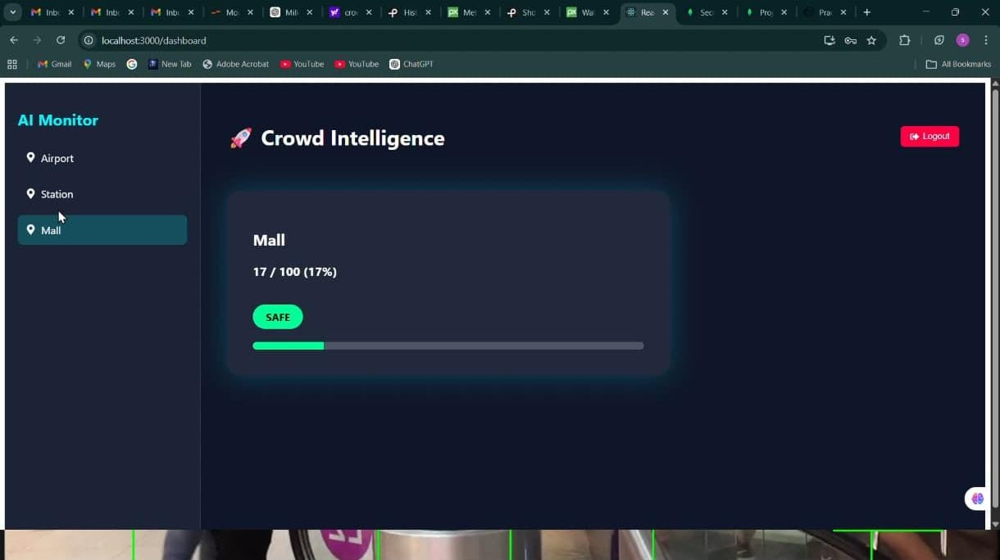
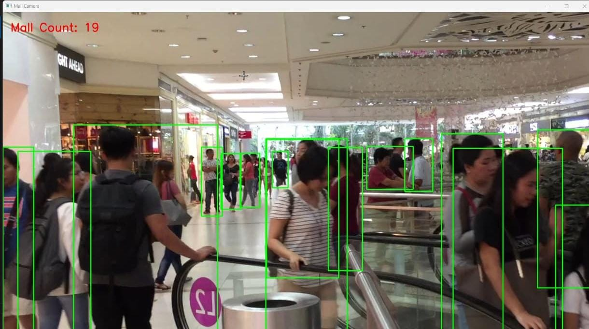
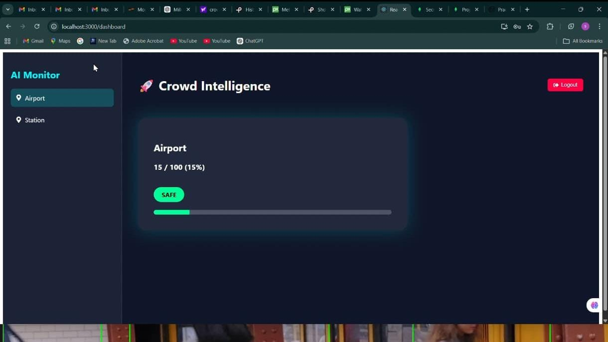
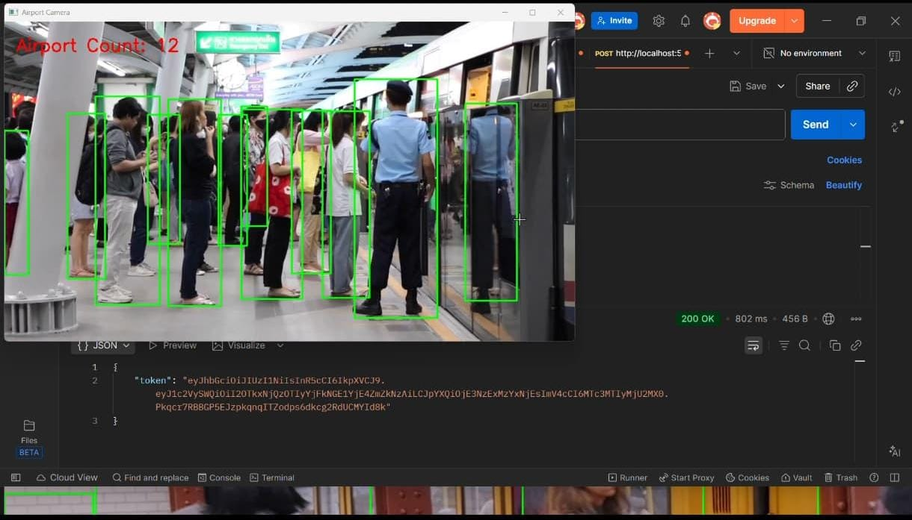

# AI Crowd Monitoring System

AI Crowd Monitoring System is a full-stack application that detects and monitors crowd density using computer vision and visualizes the information through a web dashboard.

The system uses an AI detection engine to count people from video frames and sends the crowd data to a backend API. A React dashboard displays the crowd information in real time.

This project demonstrates how **computer vision can be integrated with a full-stack MERN application** to build an intelligent monitoring platform.

---

# Motivation

Crowd monitoring is important for managing safety and planning in public spaces such as tourist locations, transportation hubs, and large events.

This project explores how **AI-based people detection combined with web technologies** can help estimate crowd density and provide visual insights through an interactive dashboard.

Although the current implementation uses recorded video streams for demonstration, the system architecture can support **integration with live CCTV feeds**.

---

# Key Features

• Real-time person detection using computer vision
• Crowd counting using YOLO object detection
• Full-stack MERN architecture
• RESTful backend API for crowd data
• Interactive React dashboard for monitoring
• Modular and scalable system design

---
## 📸 Screenshots

### 🏬 Mall Monitoring Dashboard


### 👥 Crowd Detection (Mall)


### ✈️ Airport Monitoring Dashboard


### 🔗 API + Detection Output


---

# System Architecture

Video Source / Camera
↓
AI Detection Engine (Python + YOLO)
↓
Backend API (Node.js + Express)
↓
Database (MongoDB)
↓
Frontend Dashboard (React)

---

# Project Structure

```
crowd-monitoring-system/
│
├── ai-crowd-engine/
│   └── detect.py
│
├── crowd-monitoring-server/
│   ├── controllers/
│   ├── models/
│   ├── routes/
│   ├── package.json
│   └── server.js
│
├── crowd-monitoring-client/
│   ├── public/
│   ├── src/
│   ├── package.json
│   └── package-lock.json
│
└── README.md
```
# Technologies Used

## Frontend

React
React Router
Axios

## Backend

Node.js
Express.js

## Database

MongoDB

## AI Module

Python
OpenCV
YOLO Object Detection

---

# Example Workflow

1. A video stream or recorded footage is provided as input.
2. The AI engine analyzes each frame using a YOLO object detection model.
3. Detected individuals are counted to estimate crowd density.
4. Crowd data is sent to the backend API.
5. The React dashboard retrieves and displays crowd statistics.

---

# Sample API Endpoints

POST /api/ai/crowd-data
Receives crowd detection results from the AI engine.

GET /api/locations
Returns monitored locations.

POST /api/auth/login
Handles user authentication.

---

# Requirements

Node.js (v16 or higher)
Python (v3.8 or higher)
MongoDB

---

# Running the Project

## Run Backend Server

cd crowd-monitoring-server
npm install
npm start

## Run Frontend Client

cd crowd-monitoring-client
npm install
npm start

Open in browser:

http://localhost:3000

## Run AI Detection Engine

cd ai-crowd-engine
python detect.py

---

# Use Cases

• Crowd monitoring in public places
• Event crowd management
• Smart city analytics
• Monitoring tourist locations or transportation hubs

---

# Future Improvements

• Integration with live CCTV streams
• Crowd density heatmap visualization
• Alert system for overcrowded locations
• Cloud deployment and scalability

---

# Learning Outcomes

• Developed a full-stack MERN application
• Integrated computer vision with web technologies
• Designed REST APIs for AI data processing
• Built a modular system architecture

---

# Author

Yallamanda Madhulatha
B.Tech Computer Science Engineering
Anurag University
